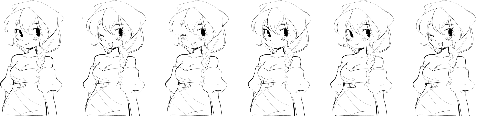

# Custom Portraits HD

Custom Portraits allows you to change the portraits (sometimes referred to as busts) of NPCs in the game in a structured way while also allowing use of HD images.

Advantages compared to using the Custom Textures mod are:

* HD images can be used
* Convenient debugging commands/shortcuts for instantly talking to an NPC, triggering different emotes, etc
* A clean structure for naming image files - no more looking up widely inconsistent image names in the game code
* Consistent image proportions and sprite sizing - sometimes the game images were positioned with different spacings depending on the NPC and season.

## Getting started

Any .png file in the plugins/CustomPortraits folder will be loaded by the plugin. You can use subfolders if you wish, e.g. plugins/CustomPortraits/mymodname.

Each NPC has in total 31 different poses you can override, comprising of 6 different image files:

* 6 Spring poses
* 6 Summer poses
* 6 Fall poses
* 6 Winter poses
* 6 Swimsuit poses (despite 6 poses being included in the images, the game currently does not show any but the first)
* 1 Marriage/wedding pose

If you wanted to provide custom Portraits for Lynn, the filenames would be:

```
Lynn_Spring.png
Lynn_Summer.png
Lynn_Fall.png
Lynn_Winter.png
Lynn_Swimsuit.png
Lynn_Wedding.png
```

If you want to change a different NPC, just put the NPC name in your filename instead.

## Emotes

For the images that contain 6 poses, your image should consist of 6 portraits side by side. In order, the emotes are:

1. Normal
2. Romantic
3. Happy
4. Mad
5. Embarrassed
6. Sad

## Image sizes

The sizing of your images is completely up to you. The mod will automatically scale up/down the images you provide. This means that you can draw portraits in a much higher resolution than the ones in-game, and thus they will no longer appear pixelated - or in other words, they'll be "HD".

As a general rule, you should aim for the aspect ratio of your portraits to be around 71:100. For example, if your portrait is 710px wide, it would be 1000px high.

For the images expected to contain 6 poses, you'd include 6 copies of the portrait, and so the image would be 6x as wide. In this example, for 1000px high portraits, the width of the entire image would be 710*6=4260px.

Example sketch file:



## Convenience features for mod authors

Finding NPCs to test the mod with is annoying, so the mod contains various convenience features for mod authors. To enable them, open up BepInEx/config/CustomPortraits.cfg and set ModAuthor to true. You must have ran the game with the mod installed at least once for this file to appear.

If cheats are enabled, you can use the console command `/npctalk Lynn` to instantly open up a dialogue window with an NPC even if they are not near.

While a dialogue window is open, you can use the following keyboard shortcuts:

* LCtrl + Z: Each time pressed scrolls through a different emote for the current season
* LCtrl + LAlt + Z: Shows marriage picture
* LCtrl + LShift + Z: SHows swimsuit picture
* LCtrl + X: Reloads all custom portraits (so you can see your changes without restarting the game)

## Need help? Something not working?

Feel free to join my discord: https://discord.gg/NCdDfYPPyy


